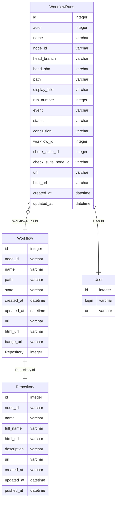

# github-metrics

```mermaid
erDiagram
 
  Workflow {
    id integer
    node_id varchar
    name varchar
    path varchar
    state varchar
    created_at datetime
    updated_at datetime
    url varchar
    html_url varchar
    badge_url varchar
    Repository integer
  }

  WorkflowRuns {
    id integer
    actor integer
    name varchar
    node_id varchar
    head_branch varchar
    head_sha varchar
    path varchar
    display_title varchar
    run_number integer
    event varchar
    status varchar
    conclusion varchar
    workflow_id integer
    check_suite_id integer
    check_suite_node_id varchar
    url varchar
    html_url varchar
    created_at datetime
    updated_at datetime
  }

  Repository {
    id integer
    node_id varchar
    name varchar
    full_name varchar
    html_url varchar
    description varchar
    url varchar
    created_at varchar
    updated_at datetime
    pushed_at datetime
  }

  User {
    id integer
    login varchar
    url varchar
  }
  
  Workflow only one to only one Repository: "Repository.Id"
  WorkflowRuns zero or more to only one Workflow: "WorkflowRuns.Id"
  WorkflowRuns only one to only one User: "User.Id"
```
